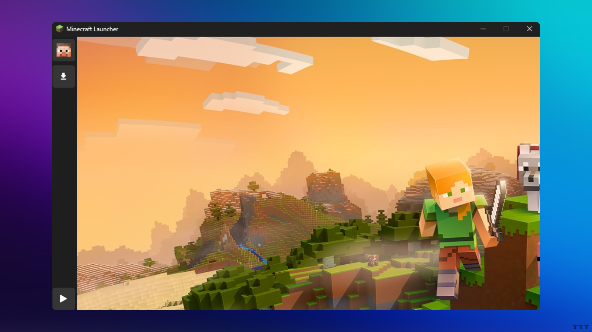

# MinePy-Launcher

MinePy is an **open-source Minecraft Launcher** built in **Python**. Download it now for free and discover new possibilities!



---

## ⬇️ Download

Dowload MinePy for Windows:

- [Download for Windows](https://github.com/Wyxemon/MinePy-Launcher/releases/tag/0.1v)

---

## 🌐 Visit Our Website

For more information and detailed documentation, visit our official website:  
[MinePy Website](https://mine-py-web.vercel.app/)

---

## 🚀 How to Run

Follow these steps to install and run MinePy-Launcher on your local machine:

1. Clone the repository:  
   ```bash
   git clone https://github.com/Wyxemon/MinePy-Launcher.git
