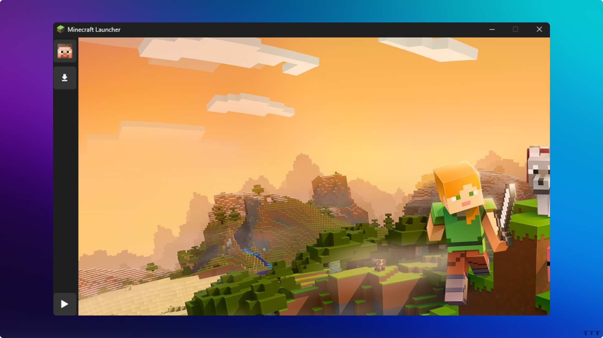

# MinePy-Launcher

MinePy is an **open-source Minecraft Launcher** built in **Python**. Download it now for free and discover new possibilities!



---

## ⬇️ Download

Dowload MinePy for Windows:

- [Download for Windows](https://github.com/Wyxemon/MinePy/releases/tag/0.1v)

---

## 🌐 Visit Our Website

For more information and detailed documentation, visit our official website:  
[MinePy Website](https://mine-py-web.vercel.app/)

---

## 🚀 How to Run

Follow these steps to install and run MinePy-Launcher on your local machine:

1. Clone the repository:  
   ```bash
   git clone https://github.com/Wyxemon/MinePy.git
   ```

2. Navigate to the project directory:  
   ```bash
   cd MinePy
   ```

3. Install the dependencies:  
   ```bash
   pip install -r requirements.txt
   ```

4. Run the application:  
   ```bash
   python main.py
   ```

---

## 🛠️ How to Build

Generate an executable using PyInstaller. Install it if you haven't already:

```bash
pip install pyinstaller
```

Then run the following command:

```bash
pyinstaller --onefile --name MinePy-Launcher main.py
```

---

## 📜 License
MinePy is open source and you can do whatever you want.